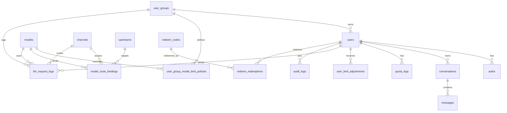

# MrChat v0.1 数据模型与状态机

- 状态：实现设计草案
- 日期：2026-03-18
- 依赖基线：`docs/Requirements-Baseline-v0.1.md`

## 1. 目标

这份文档定义 v0.1 当前已经收敛的数据域，重点覆盖用户分组、模型渠道、限额策略、请求日志与聊天状态流转。

## 2. 设计原则

- 核心业务表统一使用 UUID 主键
- `users.user_group_id` 是用户唯一分组归属
- `user_groups` 与 `channels` 必须拆分，不复用同一 `group` 语义
- `quota_logs` 是余额账本真相
- `llm_request_logs` 是请求次数、tokens、渠道与未来 RPM 聚合真相
- 会话与消息使用软删除
- 运行时冷却、限流和缓存优先放 Redis 或内存，可降级

## 3. 关系图

## 4. 核心数据表

### 4.1 `users`

用途：

- 用户主体信息
- 当前角色、状态、余额
- 当前所属 `user_group`

关键字段：

| 字段 | 类型 | 说明 |
|---|---|---|
| `id` | uuid | 主键 |
| `username` | varchar(50) | 唯一用户名 |
| `email` | varchar(100) | 唯一邮箱 |
| `display_name` | varchar(100) | 展示名 |
| `role` | varchar(16) | `root/admin/user` |
| `status` | varchar(16) | `active/disabled/pending` |
| `quota` | bigint | 当前余额 |
| `used_quota` | bigint | 累计已消耗额度缓存 |
| `user_group_id` | uuid nullable | 用户唯一分组 |
| `settings_json` | jsonb | 时区、语言等偏好 |
| `last_login_at` | timestamptz nullable | 最近登录时间 |
| `created_at` | timestamptz | 创建时间 |
| `updated_at` | timestamptz | 更新时间 |
| `deleted_at` | timestamptz nullable | 软删除时间 |

关键索引：

- unique(`username`)
- unique(`email`)
- index(`role`, `status`)
- index(`user_group_id`)

### 4.2 `auths`

用途：

- 存放密码或第三方认证凭据

关键字段：

| 字段 | 类型 | 说明 |
|---|---|---|
| `id` | uuid | 主键 |
| `user_id` | uuid | 关联用户 |
| `auth_type` | varchar(32) | `password/oauth` |
| `provider` | varchar(50) nullable | OAuth 来源 |
| `provider_subject` | varchar(255) nullable | OAuth 主体 ID |
| `password_hash` | varchar(255) nullable | 密码哈希 |
| `verified_at` | timestamptz nullable | 验证时间 |
| `last_login_at` | timestamptz nullable | 最近登录 |

### 4.3 `user_groups`

用途：

- 用户运营分组
- 限额模板归属

关键字段：

| 字段 | 类型 | 说明 |
|---|---|---|
| `id` | uuid | 主键 |
| `name` | varchar(100) | 分组名 |
| `description` | text nullable | 描述 |
| `status` | varchar(16) | `active/disabled` |
| `permissions_json` | jsonb | 扩展权限位 |
| `metadata_json` | jsonb | 扩展元数据 |
| `created_at` | timestamptz | 创建时间 |
| `updated_at` | timestamptz | 更新时间 |

说明：

- v0.1 以 `users.user_group_id` 表达单归属
- 历史 `groups` / `group_members` 仅作为迁移兼容来源保留，不再作为主业务真相

### 4.4 `upstreams`

用途：

- 实际外部请求目标

关键字段：

| 字段 | 类型 | 说明 |
|---|---|---|
| `id` | uuid | 主键 |
| `name` | varchar(100) | 名称 |
| `provider_type` | varchar(50) | `openai_compatible` 为主 |
| `base_url` | varchar(500) | 上游地址 |
| `auth_type` | varchar(32) | `bearer/basic/custom` |
| `auth_config_encrypted` | jsonb | 鉴权配置 |
| `status` | varchar(32) | `active/disabled/maintenance` |
| `timeout_seconds` | integer | 超时 |
| `cooldown_seconds` | integer | 失败冷却时间 |
| `failure_threshold` | integer | 连续失败阈值 |

### 4.5 `channels`

用途：

- 模型渠道、计费通道和路由维度

关键字段：

| 字段 | 类型 | 说明 |
|---|---|---|
| `id` | uuid | 主键 |
| `name` | varchar(100) | 渠道名 |
| `description` | text nullable | 描述 |
| `status` | varchar(16) | `active/disabled` |
| `billing_config_json` | jsonb | 计费与结算口径 |
| `metadata_json` | jsonb | 扩展元数据 |

### 4.6 `models`

用途：

- 用户面向的逻辑模型定义

关键字段：

| 字段 | 类型 | 说明 |
|---|---|---|
| `id` | uuid | 主键 |
| `model_key` | varchar(100) | 逻辑模型标识 |
| `display_name` | varchar(200) | 展示名 |
| `provider_type` | varchar(50) | 请求协议类型 |
| `context_length` | integer | 上下文长度 |
| `max_output_tokens` | integer nullable | 输出上限 |
| `pricing_json` | jsonb | 单价配置 |
| `capabilities_json` | jsonb | streaming、vision 等能力 |
| `visible_user_group_ids_json` | jsonb | 可见用户组列表，空数组表示全员可见 |
| `status` | varchar(32) | `active/disabled` |
| `metadata_json` | jsonb | 扩展字段 |

### 4.7 `model_route_bindings`

用途：

- 为模型建立默认或按 `channel` 的上游优先级列表

关键字段：

| 字段 | 类型 | 说明 |
|---|---|---|
| `id` | uuid | 主键 |
| `model_id` | uuid | 模型 ID |
| `channel_id` | uuid nullable | 为空表示默认路由 |
| `upstream_id` | uuid | 上游 ID |
| `priority` | integer | 数字越小优先级越高 |
| `status` | varchar(32) | `active/disabled` |

关键约束：

- unique(`model_id`, `channel_id`, `priority`)

### 4.8 `conversations`

用途：

- 用户聊天会话

关键字段：

| 字段 | 类型 | 说明 |
|---|---|---|
| `id` | uuid | 主键 |
| `user_id` | uuid | 所属用户 |
| `title` | varchar(200) | 标题 |
| `model_id` | uuid nullable | 默认模型 |
| `status` | varchar(16) | `active/archived/deleted` |
| `message_count` | integer | 消息数缓存 |
| `last_message_at` | timestamptz nullable | 最近消息时间 |
| `metadata_json` | jsonb | 扩展数据 |
| `deleted_at` | timestamptz nullable | 软删除时间 |

### 4.9 `messages`

用途：

- 会话消息正文与状态

关键字段：

| 字段 | 类型 | 说明 |
|---|---|---|
| `id` | uuid | 主键 |
| `conversation_id` | uuid | 所属会话 |
| `user_id` | uuid | 所属用户 |
| `model_id` | uuid nullable | 命中模型 |
| `upstream_id` | uuid nullable | 命中上游 |
| `request_id` | varchar(64) nullable | 请求 ID |
| `role` | varchar(16) | `system/user/assistant/tool` |
| `content` | text | 正文 |
| `reasoning_content` | text nullable | 推理内容 |
| `status` | varchar(16) | `pending/streaming/completed/failed/cancelled` |
| `finish_reason` | varchar(32) nullable | 结束原因 |
| `usage_json` | jsonb | token usage |
| `error_code` | varchar(100) nullable | 错误码 |
| `metadata_json` | jsonb | 扩展元数据 |
| `deleted_at` | timestamptz nullable | 软删除时间 |

### 4.10 `quota_logs`

用途：

- 余额账本流水

关键字段：

| 字段 | 类型 | 说明 |
|---|---|---|
| `id` | uuid | 主键 |
| `user_id` | uuid | 用户 ID |
| `request_id` | varchar(64) nullable | 对应请求 |
| `log_type` | varchar(32) | `pre_deduct/final_charge/refund/redeem/admin_adjust` |
| `delta_quota` | bigint | 本次变化额度 |
| `balance_after` | bigint | 变更后余额 |
| `reason` | varchar(255) nullable | 原因 |
| `created_at` | timestamptz | 创建时间 |

说明：

- 只负责余额结算
- 不承担请求次数、token 聚合真相

### 4.11 `user_group_model_limit_policies`

用途：

- 用户组默认模板与模型覆盖规则

关键字段：

| 字段 | 类型 | 说明 |
|---|---|---|
| `id` | uuid | 主键 |
| `user_group_id` | uuid | 用户组 ID |
| `model_id` | uuid nullable | 为空表示默认模板 |
| `hour_request_limit` | bigint nullable | 最近 1 小时请求数上限 |
| `week_request_limit` | bigint nullable | 最近 7 天请求数上限 |
| `lifetime_request_limit` | bigint nullable | 生命周期请求数上限 |
| `hour_token_limit` | bigint nullable | 最近 1 小时 tokens 上限 |
| `week_token_limit` | bigint nullable | 最近 7 天 tokens 上限 |
| `lifetime_token_limit` | bigint nullable | 生命周期 tokens 上限 |
| `status` | varchar(16) | `active/disabled` |

规则：

- 先匹配 `(user_group_id, model_id)`
- 再回退 `(user_group_id, null)`
- 再命不中则视为无限额

### 4.12 `user_limit_adjustments`

用途：

- 单用户 direct adjustment 账本

关键字段：

| 字段 | 类型 | 说明 |
|---|---|---|
| `id` | uuid | 主键 |
| `user_id` | uuid | 用户 ID |
| `model_id` | uuid nullable | 为空表示作用于全部模型 |
| `metric_type` | varchar(32) | `request_count/total_tokens` |
| `window_type` | varchar(32) | `rolling_hour/rolling_week/lifetime` |
| `delta` | bigint | 增减量 |
| `expires_at` | timestamptz nullable | 到期时间 |
| `reason` | varchar(255) nullable | 调整原因 |
| `actor_user_id` | uuid nullable | 操作者 |
| `created_at` | timestamptz | 创建时间 |

规则：

- `rolling_hour` 默认 `created_at + 1h`
- `rolling_week` 默认 `created_at + 7d`
- `lifetime` 不过期

### 4.13 `llm_request_logs`

用途：

- 记录每次聊天请求的统计、渠道、状态与错误

关键字段：

| 字段 | 类型 | 说明 |
|---|---|---|
| `id` | uuid | 主键 |
| `request_id` | varchar(64) | 请求唯一标识 |
| `user_id` | uuid | 用户 ID |
| `user_group_id` | uuid nullable | 请求时用户分组 |
| `conversation_id` | uuid nullable | 会话 ID |
| `message_id` | uuid nullable | 消息 ID |
| `model_id` | uuid nullable | 模型 ID |
| `channel_id` | uuid nullable | 渠道 ID |
| `prompt_tokens` | bigint | 输入 tokens |
| `completion_tokens` | bigint | 输出 tokens |
| `total_tokens` | bigint | 总 tokens |
| `billed_quota` | bigint | 计费额度 |
| `status` | varchar(32) | `pending/completed/failed/cancelled/rejected` |
| `error_code` | varchar(100) nullable | 错误码 |
| `started_at` | timestamptz | 开始时间 |
| `completed_at` | timestamptz nullable | 完成时间 |
| `metadata_json` | jsonb | 扩展元数据 |

说明：

- 未来 RPM、tokens 聚合、失败率与渠道报表都基于这张表或其缓存聚合
- `rejected` 主要用于额度、权限或前置校验拒绝

### 4.14 `redeem_codes` / `redeem_redemptions`

用途：

- 兑换码批次与兑换记录

### 4.15 `audit_logs`

用途：

- 管理操作审计真相

至少覆盖：

- 上游变更
- 渠道变更
- 模型变更
- 用户组变更
- 用户分组调整
- 用户额度调额
- 用户限额调整

## 5. 状态机

### 5.1 UserGroup

- `active` -> 可分配给用户，可参与模型可见性与限额解析
- `disabled` -> 不再用于新分配；是否保留既有用户归属由后台策略控制

### 5.2 Channel

- `active` -> 可参与模型路由
- `disabled` -> 不参与新请求路由

### 5.3 Model

- `active` -> 对用户可见，且允许路由
- `disabled` -> 不对用户提供

### 5.4 Conversation

- `active` -> 正常可读写
- `archived` -> 保留历史，默认不再写入
- `deleted` -> 软删除

### 5.5 Message

- `pending` -> 已入队，等待上游
- `streaming` -> 正在流式输出
- `completed` -> 正常完成
- `failed` -> 上游或系统失败
- `cancelled` -> 用户或连接中断取消

### 5.6 LLMRequestLog

- `pending` -> 请求已创建，尚未结束
- `completed` -> 成功完成
- `failed` -> 上游失败或内部错误
- `cancelled` -> 主动取消
- `rejected` -> 在调用上游前被拒绝

## 6. 限额判定规则

- 先读取 `users.user_group_id`
- 按 `user_group_model_limit_policies` 解析有效模板
- 按 `llm_request_logs` 聚合最近 1h、7d、lifetime 的请求数与 tokens
- 叠加 `user_limit_adjustments`
- 请求数先校验 `used + 1 <= limit + adjustment`
- token 再校验 `used + prompt_tokens + reserved_completion_tokens <= limit + adjustment`
- 任一窗口超限则拒绝

## 7. 实现状态说明

- 当前数据库迁移已经包含：
  - `user_groups`
  - `channels`
  - `user_group_model_limit_policies`
  - `user_limit_adjustments`
  - `llm_request_logs`
- 当前后台 API 已支持：
  - 用户组 CRUD
  - 用户组限额模板批量维护
  - 用户分组调整
  - 用户限额使用查询
  - 用户 direct adjustment
- 当前 `POST /api/v1/chat/completions` 真实上游调用仍在后续里程碑中，限额引擎与请求日志结构已先行落地
