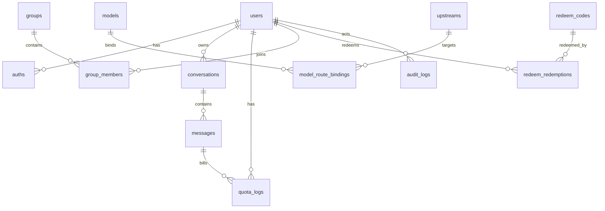
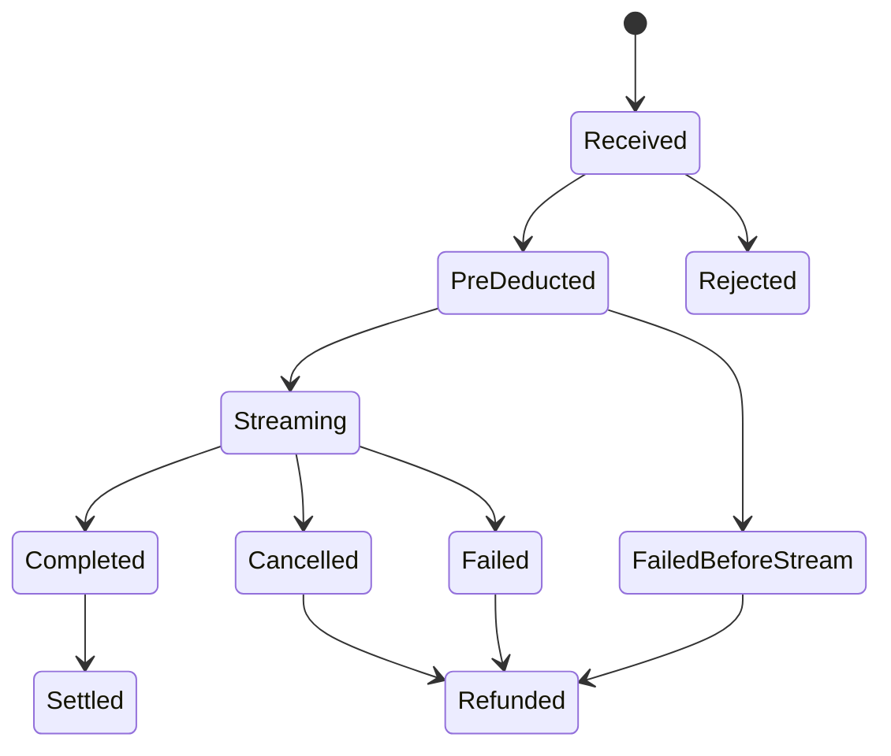

# MrChat v0.1 数据模型与状态机

- 状态：实现设计草案
- 日期：2026-03-12
- 依赖基线：`docs/Requirements-Baseline-v0.1.md`

## 1. 目标

这份文档定义 v0.1 的核心数据表、主要关系、关键索引与状态机，供后端表结构设计、ORM 建模与业务状态流转实现使用。

## 2. 设计原则

- 核心业务表统一使用 UUID 主键
- 用户余额与用量分离：`users.quota` 表示当前余额，`quota_logs` 表示变动流水
- 消息与会话做软删除
- 持久化状态与运行时状态分开建模
- 运行时冷却/黑名单优先放内存或 Redis，不强塞进主业务表

## 3. 关系图

## 4. 核心数据表

## 4.1 `users`

用途：

- 用户主体信息
- 当前角色与状态
- 当前可用额度

建议字段：

| 字段 | 类型 | 说明 |
|---|---|---|
| `id` | uuid string | 主键 |
| `username` | varchar(50) | 唯一用户名 |
| `email` | varchar(100) | 唯一邮箱 |
| `display_name` | varchar(100) | 展示名 |
| `avatar_url` | varchar(500) nullable | 头像 |
| `role` | enum | `root/admin/user` |
| `status` | enum | `active/disabled/pending` |
| `quota` | bigint | 当前可用额度 |
| `used_quota` | bigint | 累计已消耗额度，可作为汇总缓存 |
| `primary_group_id` | uuid nullable | 默认用户组 |
| `settings_json` | json | 时区、语言等偏好 |
| `aff_code` | varchar(32) nullable | P1 邀请码 |
| `inviter_id` | uuid nullable | P1 邀请人 |
| `last_login_at` | timestamp nullable | 最近登录时间 |
| `created_at` | timestamp | 创建时间 |
| `updated_at` | timestamp | 更新时间 |
| `deleted_at` | timestamp nullable | 软删除时间 |

建议索引：

- unique(`username`)
- unique(`email`)
- index(`role`, `status`)
- index(`primary_group_id`)

实现备注：

- `quota` 是余额口径
- 若保留 `used_quota`，要明确它是汇总缓存，不是账本真相源

## 4.2 `auths`

用途：

- 认证凭据与登录来源

建议字段：

| 字段 | 类型 | 说明 |
|---|---|---|
| `id` | uuid string | 主键 |
| `user_id` | uuid | 关联用户 |
| `auth_type` | enum | `password/oauth` |
| `provider` | varchar(50) nullable | `github/google/...` |
| `provider_subject` | varchar(255) nullable | OAuth 主体 ID |
| `password_hash` | varchar(255) nullable | 密码哈希 |
| `verified_at` | timestamp nullable | 验证时间 |
| `last_login_at` | timestamp nullable | 最近登录 |
| `created_at` | timestamp | 创建时间 |
| `updated_at` | timestamp | 更新时间 |

建议索引：

- index(`user_id`)
- unique(`provider`, `provider_subject`)

## 4.3 `groups`

用途：

- 用户分组与模型可见性边界

建议字段：

| 字段 | 类型 | 说明 |
|---|---|---|
| `id` | uuid string | 主键 |
| `name` | varchar(100) | 组名 |
| `description` | text nullable | 描述 |
| `status` | enum | `active/disabled` |
| `permissions_json` | json nullable | 可扩展权限 |
| `created_at` | timestamp | 创建时间 |
| `updated_at` | timestamp | 更新时间 |

## 4.4 `group_members`

用途：

- 用户与分组关系

建议字段：

| 字段 | 类型 | 说明 |
|---|---|---|
| `id` | uuid string | 主键 |
| `group_id` | uuid | 分组 ID |
| `user_id` | uuid | 用户 ID |
| `member_role` | enum | `owner/admin/member` |
| `created_at` | timestamp | 加入时间 |

建议索引：

- unique(`group_id`, `user_id`)

## 4.5 `upstreams`

用途：

- 存储实际请求目标与鉴权信息

建议字段：

| 字段 | 类型 | 说明 |
|---|---|---|
| `id` | uuid string | 主键 |
| `name` | varchar(100) | 名称 |
| `provider_type` | enum | v0.1 先以 `openai_compatible` 为主 |
| `base_url` | varchar(500) | 上游地址 |
| `auth_type` | enum | `bearer/basic/custom` |
| `auth_config_encrypted` | text | 加密后的密钥配置 |
| `status` | enum | `active/disabled/maintenance` |
| `timeout_seconds` | int | 超时 |
| `cooldown_seconds` | int | 失败冷却时间 |
| `failure_threshold` | int | 连续失败阈值 |
| `metadata_json` | json nullable | 扩展配置 |
| `created_at` | timestamp | 创建时间 |
| `updated_at` | timestamp | 更新时间 |

建议索引：

- unique(`name`)
- index(`status`)
- index(`provider_type`)

实现备注：

- 冷却中的临时状态不建议直接写表
- `blacklist_until` 与失败计数可优先存放在内存或 Redis

## 4.6 `models`

用途：

- 用户面向的逻辑模型定义

建议字段：

| 字段 | 类型 | 说明 |
|---|---|---|
| `id` | uuid string | 主键 |
| `model_key` | varchar(100) | 逻辑模型标识 |
| `display_name` | varchar(200) | 展示名 |
| `provider_type` | enum | 请求协议类型 |
| `context_length` | int | 上下文长度 |
| `max_output_tokens` | int nullable | 输出上限 |
| `pricing_json` | json | 输入/输出单价 |
| `capabilities_json` | json | streaming、vision 等 |
| `status` | enum | `active/disabled` |
| `metadata_json` | json nullable | 扩展字段 |
| `created_at` | timestamp | 创建时间 |
| `updated_at` | timestamp | 更新时间 |

建议索引：

- unique(`model_key`)
- index(`status`)

## 4.7 `model_route_bindings`

用途：

- 为模型建立默认或按分组的上游优先级列表

建议字段：

| 字段 | 类型 | 说明 |
|---|---|---|
| `id` | uuid string | 主键 |
| `model_id` | uuid | 模型 ID |
| `group_id` | uuid nullable | 为空表示全局默认 |
| `upstream_id` | uuid | 上游 ID |
| `priority` | int | 数值越小优先级越高 |
| `status` | enum | `active/disabled` |
| `created_at` | timestamp | 创建时间 |
| `updated_at` | timestamp | 更新时间 |

建议索引：

- unique(`model_id`, `group_id`, `priority`)
- index(`upstream_id`)

## 4.8 `conversations`

用途：

- 会话实体

建议字段：

| 字段 | 类型 | 说明 |
|---|---|---|
| `id` | uuid string | 主键 |
| `user_id` | uuid | 所属用户 |
| `title` | varchar(255) | 会话标题 |
| `model_id` | uuid nullable | 当前默认模型 |
| `status` | enum | `active/archived/deleted` |
| `message_count` | int | 消息数缓存 |
| `last_message_at` | timestamp nullable | 最近消息时间 |
| `metadata_json` | json nullable | 扩展字段 |
| `created_at` | timestamp | 创建时间 |
| `updated_at` | timestamp | 更新时间 |
| `deleted_at` | timestamp nullable | 软删除时间 |

建议索引：

- index(`user_id`, `status`, `last_message_at`)

## 4.9 `messages`

用途：

- 对话中的用户/助手消息

建议字段：

| 字段 | 类型 | 说明 |
|---|---|---|
| `id` | uuid string | 主键 |
| `conversation_id` | uuid | 会话 ID |
| `user_id` | uuid | 所属用户 |
| `model_id` | uuid nullable | 本次使用模型 |
| `upstream_id` | uuid nullable | 实际命中的上游 |
| `request_id` | varchar(64) nullable | 请求追踪 ID |
| `role` | enum | `system/user/assistant/tool` |
| `content` | longtext | 正文 |
| `reasoning_content` | longtext nullable | 推理内容 |
| `status` | enum | `pending/streaming/completed/failed/cancelled` |
| `finish_reason` | varchar(50) nullable | `stop/length/cancelled/error` |
| `usage_json` | json nullable | token 统计 |
| `error_code` | varchar(100) nullable | 错误码 |
| `metadata_json` | json nullable | 扩展字段 |
| `created_at` | timestamp | 创建时间 |
| `updated_at` | timestamp | 更新时间 |
| `deleted_at` | timestamp nullable | 软删除时间 |

建议索引：

- index(`conversation_id`, `created_at`)
- index(`request_id`)
- index(`status`)

实现备注：

- 用户消息与助手消息都落在同一张表
- 流式阶段建议只在内存中聚合，完成后再落库最终内容

## 4.10 `quota_logs`

用途：

- 额度账本流水

建议字段：

| 字段 | 类型 | 说明 |
|---|---|---|
| `id` | uuid string | 主键 |
| `user_id` | uuid | 用户 ID |
| `conversation_id` | uuid nullable | 会话 ID |
| `message_id` | uuid nullable | 关联消息 |
| `model_id` | uuid nullable | 关联模型 |
| `request_id` | varchar(64) nullable | 请求 ID |
| `log_type` | enum | `pre_deduct/final_charge/refund/redeem/admin_adjust` |
| `delta_quota` | bigint | 正数加额，负数扣额 |
| `balance_after` | bigint | 操作后余额 |
| `usage_json` | json nullable | usage 快照 |
| `operator_user_id` | uuid nullable | 管理员调额操作者 |
| `reason` | varchar(255) nullable | 原因 |
| `created_at` | timestamp | 创建时间 |

建议索引：

- index(`user_id`, `created_at`)
- index(`request_id`)
- index(`log_type`)

实现备注：

- `quota_logs` 是额度变动真相源
- 对账与报表优先从这张表聚合

## 4.11 `redeem_codes`

用途：

- 兑换码主表

建议字段：

| 字段 | 类型 | 说明 |
|---|---|---|
| `id` | uuid string | 主键 |
| `batch_no` | varchar(64) | 批次号 |
| `code_hash` | varchar(255) | 哈希值 |
| `quota_amount` | bigint | 面额 |
| `max_redemptions` | int | 最大兑换次数 |
| `redeemed_count` | int | 已兑换次数 |
| `status` | enum | `active/used/expired/disabled` |
| `valid_from` | timestamp nullable | 生效时间 |
| `valid_until` | timestamp nullable | 过期时间 |
| `created_by` | uuid | 管理员 ID |
| `created_at` | timestamp | 创建时间 |
| `updated_at` | timestamp | 更新时间 |

建议索引：

- unique(`code_hash`)
- index(`batch_no`)
- index(`status`, `valid_until`)

## 4.12 `redeem_redemptions`

用途：

- 兑换成功记录

建议字段：

| 字段 | 类型 | 说明 |
|---|---|---|
| `id` | uuid string | 主键 |
| `redeem_code_id` | uuid | 兑换码 ID |
| `user_id` | uuid | 兑换用户 |
| `quota_amount` | bigint | 实际增加额度 |
| `quota_log_id` | uuid nullable | 对应账本流水 |
| `created_at` | timestamp | 兑换时间 |

建议索引：

- unique(`redeem_code_id`, `user_id`) 仅适用于一次性码
- index(`user_id`, `created_at`)

实现备注：

- 失败兑换尝试不一定要入本表，建议进入 `audit_logs`

## 4.13 `audit_logs`

用途：

- 记录关键管理与安全相关行为

建议字段：

| 字段 | 类型 | 说明 |
|---|---|---|
| `id` | uuid string | 主键 |
| `actor_user_id` | uuid nullable | 操作者 |
| `actor_role` | varchar(20) nullable | 操作者角色 |
| `action` | varchar(100) | 动作 |
| `resource_type` | varchar(100) | 资源类型 |
| `resource_id` | varchar(100) nullable | 资源 ID |
| `target_user_id` | uuid nullable | 目标用户 |
| `request_id` | varchar(64) nullable | 请求 ID |
| `ip_address` | varchar(64) nullable | IP |
| `user_agent` | text nullable | UA |
| `result` | enum | `success/failed` |
| `detail_json` | json nullable | 细节 |
| `created_at` | timestamp | 创建时间 |

建议索引：

- index(`actor_user_id`, `created_at`)
- index(`resource_type`, `resource_id`)
- index(`action`, `created_at`)

## 4.14 `service_entries`（P1）

用途：

- 外部子服务入口配置

建议字段：

| 字段 | 类型 | 说明 |
|---|---|---|
| `id` | uuid string | 主键 |
| `name` | varchar(100) | 名称 |
| `slug` | varchar(100) | 路由标识 |
| `description` | text nullable | 描述 |
| `entry_url` | varchar(500) | 入口地址 |
| `launch_mode` | enum | `iframe/new_tab` |
| `icon_url` | varchar(500) nullable | 图标 |
| `badge` | varchar(50) nullable | 标签 |
| `status` | enum | `active/disabled` |
| `allowed_groups_json` | json nullable | 可见组 |
| `sort_order` | int | 排序 |
| `created_at` | timestamp | 创建时间 |
| `updated_at` | timestamp | 更新时间 |

建议索引：

- unique(`slug`)
- index(`status`, `sort_order`)

## 5. 状态机

## 5.1 Conversation 状态

| 状态 | 含义 | 可流转到 |
|---|---|---|
| `active` | 正常使用中的会话 | `archived`、`deleted` |
| `archived` | 归档会话 | `active`、`deleted` |
| `deleted` | 软删除会话 | 无 |

规则：

- v0.1 删除采用软删除
- 只有 `active` 会话出现在默认列表

## 5.2 Message 状态

| 状态 | 含义 | 可流转到 |
|---|---|---|
| `pending` | 已接收请求，尚未开始生成 | `streaming`、`failed` |
| `streaming` | 正在流式生成 | `completed`、`failed`、`cancelled` |
| `completed` | 正常完成 | 无 |
| `failed` | 生成失败 | 无 |
| `cancelled` | 被用户停止或连接中断 | 无 |

规则：

- `assistant` 消息最常见地经历 `pending -> streaming -> completed`
- 用户消息通常可直接记为 `completed`
- `cancelled` 也需要进入结算逻辑

## 5.3 Upstream 配置状态

| 状态 | 含义 |
|---|---|
| `active` | 可参与路由 |
| `disabled` | 人工停用，不参与路由 |
| `maintenance` | 维护中，不参与路由 |

运行时补充状态：

- `healthy`
- `cooling_down`

说明：

- 运行时状态建议放缓存，不直接作为主表字段真相

## 5.4 Redeem Code 状态

| 状态 | 含义 | 可流转到 |
|---|---|---|
| `active` | 可被兑换 | `used`、`expired`、`disabled` |
| `used` | 单次码已被用完，或多次码达到上限 | 无 |
| `expired` | 超过有效期 | 无 |
| `disabled` | 人工停用 | `active` |

规则：

- 多次码在 `redeemed_count < max_redemptions` 且未过期时保持 `active`

## 5.5 Chat 请求结算状态机

说明：

- `Received -> PreDeducted`：先做额度预扣
- `Streaming -> Completed`：按 usage 最终结算
- `Cancelled / Failed`：退回未消耗额度
- `Rejected`：例如权限不足、额度不足、模型不可用，不产生消息或账本流水

## 6. 关键约束与不变量

### 6.1 额度

- 任意一次 `quota` 变更都必须有对应 `quota_logs`
- `users.quota` 不得小于 0
- `balance_after` 必须等于前余额加上本次 `delta_quota`

### 6.2 路由

- 对任一 `(model_id, group_id)`，优先级列表不能重复
- 禁用的上游不能参与路由

### 6.3 兑换码

- 兑换码明文不能入库
- 成功兑换与额度增加必须在同一事务中提交

### 6.4 审计

- 管理员调额、模型修改、上游修改、兑换码批量生成必须写审计日志

## 7. 建议先落地的 ORM 模型顺序

1. `users`
2. `auths`
3. `groups`
4. `group_members`
5. `upstreams`
6. `models`
7. `model_route_bindings`
8. `conversations`
9. `messages`
10. `quota_logs`
11. `redeem_codes`
12. `redeem_redemptions`
13. `audit_logs`
14. `service_entries`（P1）

